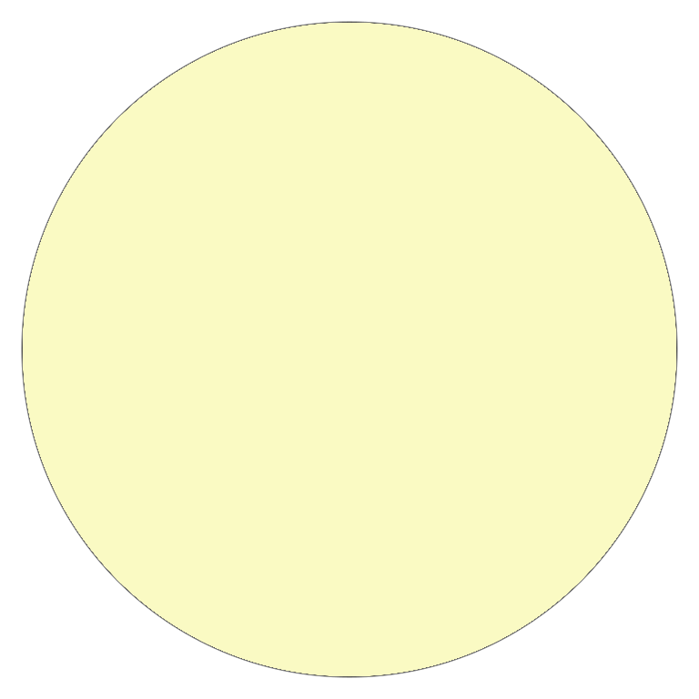

# Yin Yang Breakout

> A themed Breakout clone where black and white dots battle for dominance over a yin‑yang block grid.

[](https://www.python.org/)
[](https://www.pygame.org/)
[](https://numpy.org/)
[](LICENSE)



---

## Highlights

- **Dual‑dot gameplay** — two independent balls (black & white) bounce simultaneously, each flipping blocks to its own color.
- **Player agency** — add or remove dots at any time with hotkeys (`=`/`-` for black, `1`/`2` for white), letting you shift momentum mid‑game.
- **Deterministic win condition** — the game ends when every block on the 8×8 grid shares the same color; no score, no lives — pure conversion.
- **Smooth 120 FPS** — game loop ticks at a locked 120 frames per second for fluid motion.
- **Yin‑yang-themed board** — the starting block layout itself forms a yin‑yang symbol, reinforcing the theme.

## Architecture

```
┌──────────────┐     ┌──────────────┐     ┌──────────────┐
│    Dot       │────▶│    Block     │     │   main.py    │
│  ─────────   │     │  ─────────── │     │  ─────────── │
│  color       │     │  color       │     │  game loop   │
│  position    │     │  rect        │     │  win check   │
│  heading     │     │  draw()      │     │  dot mgmt    │
│  move()      │     │  change()    │     │  event loop  │
│  collide()   │     │              │     │              │
└──────┬───────┘     └──────┬───────┘     └──────┬───────┘
       │                    │                    │
       └────────────────────┴────────────────────┘
                     Pygame 800×800
```

### Data flow

1. **`main.py`** initializes the block grid (8×8 NumPy object array) and two `Dot` instances.
2. Each frame, every `Dot` calls `move()` (vector math with `math.sin`/`cos`) then `check_collision()` against all blocks.
3. On collision, `Block.change_color()` flips the block if the dot's color is opposite to the block's current color; the dot's heading is reflected horizontally.
4. After all dots move, `check_win()` scans the grid: if every block shares the same color, the winner screen is displayed for 5 seconds before exit.

## Tech Stack

| Layer        | Technology             |
| ------------ | ---------------------- |
| Runtime      | Python 3.11            |
| Graphics     | Pygame 2.5+            |
| Math/Data    | NumPy 1.24+            |
| Font         | Fira Sans (bundled)    |
| Image assets | PNG sprites (30 KB ea) |

## Project Structure

```
Yin-Yang-Breakout/
├── main.py              # Entry point: grid init, game loop, win logic
├── block.py             # Block class — drawable grid cell with color flip
├── dot.py               # Dot class — bouncing ball with collision & movement
├── text.py              # Standalone collision demo (development scratch file)
├── images/
│   ├── black.png        # Black dot sprite
│   └── white.png        # White dot sprite (☯ yin-yang design)
├── FiraSans-Black.ttf   # Font for winner announcement
├── requirements.txt     # Python dependencies
├── .gitignore
└── README.md
```

## Getting Started

### Prerequisites

- Python 3.11+ (CPython)
- pip

### Installation

```bash
# Clone the repo
git clone https://github.com/Adam-Zborovsky/Yin-Yang-Breakout.git
cd Yin-Yang-Breakout

# Create and activate a virtual environment (recommended)
python3 -m venv venv
source venv/bin/activate   # Linux/macOS
# venv\Scripts\activate    # Windows

# Install dependencies
pip install -r requirements.txt
```

### Run

```bash
python main.py
```

### Controls

| Key   | Action                 |
| ----- | ---------------------- |
| `=`   | Add a black dot        |
| `-`   | Remove a black dot     |
| `1`   | Add a white dot        |
| `2`   | Remove a white dot     |
| Close | Quit the game          |

> **Tip:** The black dot flips white blocks to black; the white dot flips black blocks to white. Add more dots of your target color to accelerate conversion.

## Engineering Notes

### Collision system

Collision detection uses Pygame's built-in `Rect.colliderect()` — efficient but the current implementation checks every dot against every block every frame (O(d×b)). For the small 8×8 grid (64 blocks) and a handful of dots, this is negligible.

### Edge handling

The dot reflects off all four window edges with the formula `heading = 180 - heading` (horizontal) and `heading = -heading` (vertical). This works correctly for cardinal and near‑cardinal angles but produces counter‑intuitive reflections at steep glancing angles — a future improvement could use proper surface normals.

### Known limitations

- **Block‑by‑block collision**: If a dot overlaps two blocks in the same frame, only the first collided block flips (inner loop breaks on first hit). A more robust system would resolve collisions against all overlapping blocks.
- **No paddle**: Unlike classic Breakout, there is no player‑controlled paddle — the dots are fully autonomous once launched. Player interaction is limited to adding/removing dots.
- **Soft dependency on `text.py`**: This file is a standalone Pygame collision demo and is not imported by `main.py`. Safe to delete.

### Security & hygiene

- ✅ No hardcoded URLs, API keys, or secrets.
- ✅ No personal identifiers in source.
- ⚠️ Oversized repo due to a vendored Windows virtual environment (`Yin-Yang-Breakout/` directory, ~5000 files) tracked by git. A `.gitignore` has been added to prevent recurrence; consider squashing history or using `git filter-branch` to reclaim space.

## Roadmap

- [ ] Player‑controlled paddle for classic Breakout feel
- [ ] Proper surface‑normal reflections at edges
- [ ] Multi‑block collision resolution per frame
- [ ] Sound effects (pygame.mixer)
- [ ] Score tracking and high‑score persistence
- [ ] Level editor for custom block layouts
- [ ] AI opponent mode (CPU controls one color)
- [ ] Packaged executable via PyInstaller

## License

MIT — see the [LICENSE](LICENSE) file for details.

---

*Built with Pygame and NumPy · Inspired by the yin‑yang duality*
